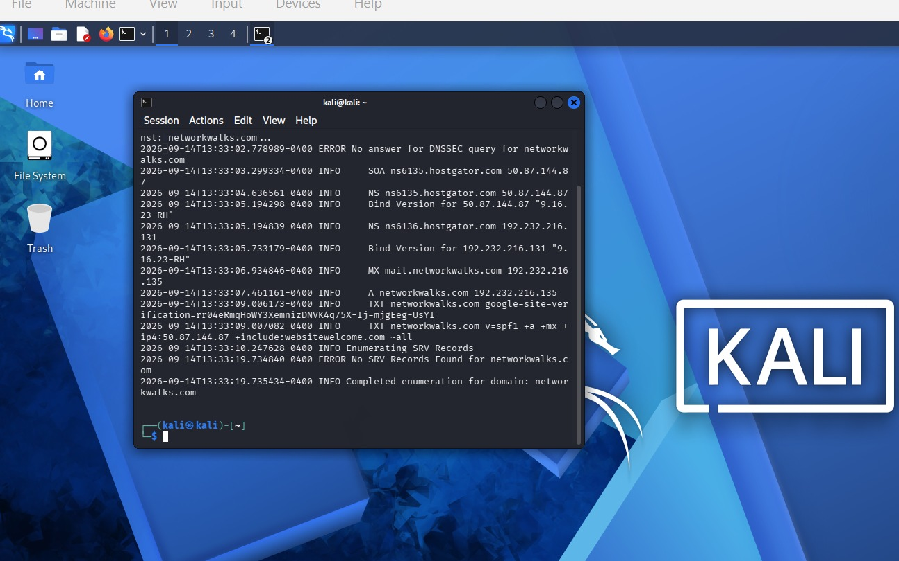

# Penetration Testing Report: Footprinting & Network Scanning Phases

**Pentester Name:** OLAGUNJU OLAKIITAN ESTHER *(Cybersecurity intern)*  
**Program/Batch:** B083-Networkwalks  
**Date:** 15 September 2026  
**Status:** Phase 1 & 2 Complete (Phases 3-5 In Progress)  
**Client/Target:**  
1. Networkwalks *(secured written permission already)*  
2. My own local LAN Network  

---

## ⚖️ 1. Liability Disclaimer
I have performed these activities only on the systems & devices where I had secured written permission or the devices/systems that I own myself. All these materials are for education and research purpose only. Do not use anything from here to break the law. The instructor, the authors and Networkwalks are not responsible for what you do with this knowledge. Every action you take is your own responsibility. Misuse can lead to criminal charges, heavy fines, loss of your job and a permanent record. In most countries unauthorised access is a crime even when nothing is damaged.

---

## 📝 2. Introduction
This report covers two practical activities completed during Week 2 of my ongoing internship program at Networkwalks. The first activity focused on footprinting the `networkwalks.com` domain using multiple Kali Linux tools (**W2-PM1**), while the second involved scanning my own local network using Zenmap (**W2-PM5**).

The two activities covered different stages of the reconnaissance process. The footprinting activity focused on gathering publicly available information about a target domain, while the network scanning activity focused on identifying live hosts and mapping devices within a local network. Together, these exercises demonstrated how information gathering can progress from collecting public information to identifying active systems on a network.

All footprinting commands were executed in Kali Linux, while the network scanning activity was performed on a Windows PC with Zenmap installed. For each practical step, I documented the command used, the result obtained, and a screenshot as evidence. I also included a brief explanation of the security relevance of each finding and how the information could potentially be useful during reconnaissance.

---

## 🛠️ 3. Tools Used

| Tool | Purpose |
| :--- | :--- |
| **Kali Linux & Windows** | Operating systems used for reconnaissance activities |
| **WHOIS** | Find domain registration details (owner, dates, name servers). |
| **Whatweb** | Fingerprint web technologies (server, CMS, plugins, IP). |
| **Nslookup** | Resolve the domain name to its IP address using DNS. |
| **curl -I** | Read the HTTP response headers of the website. |
| **wafw00f** | Detect whether a Web Application Firewall protects the site. |
| **Dnsrecon** | Enumerate all DNS records (NS, MX, SPF, TXT, SRV). |
| **Zenmap (Nmap GUI)**| Scan the local subnet to find live hosts, IPs and MAC addresses. |
| **Windows CMD** | Local IP and MAC address identification |

---

## 🏃‍♂️ 4. Activities Performed

### 4.1 Footprinting & Reconnaissance (W2-PM1)
I performed reconnaissance against the `networkwalks.com` domain using six Kali Linux tools: WHOIS, WhatWeb, Nslookup, Curl, Wafw00f and DNSRecon. Each tool was used to collect a different type of information about the target.

#### A. WHOIS Domain Registration Discovery
* **Command Used:** `whois networkwalks.com`
* **Description:** Used to obtain publicly available domain registration information and identify the domain’s name servers. The results provided information about the domain registration and hosting infrastructure.

#### B. WhatWeb Technology Fingerprinting
* **Command Used:** `whatweb networkwalks.com`
* **Description:** Used to identify technologies used by the website. The results identified WordPress 7.0.4 and WP Download Manager 3.3.58, along with other information exposed by the website.

#### C. Nslookup DNS Resolution
* **Command Used:** `nslookup networkwalks.com`
* **Description:** Resolved the domain name to its target IP address. The provided result identified `192.232.216.135`.

#### D. Curl HTTP Response Header Inspection
* **Command Used:** `curl -I networkwalks.com`
* **Description:** Read the HTTP response headers of the website to analyze server configuration metadata.

#### E. Wafw00f WAF Detection
* **Command Used:** `wafw00f networkwalks.com`
* **Description:** Used to detect whether a Web Application Firewall (WAF) protects the site and identify its vendor.

#### F. DNSRecon Records Enumeration
* **Command Used:** `dnsrecon -d networkwalks.com`
* **Description:** Used to enumerate all DNS records including NS, MX, SPF, TXT, and SRV data.

---

### 4.2 Network Scanning with Zenmap (W2-PM5)
For the second activity, I used Zenmap to perform network discovery on my local network. The practical exercise required me to identify my local IP address and subnet, discover active hosts, identify their IP and MAC addresses, and generate a network topology.

I first used the `ipconfig` command in Windows to determine my local IP address and LAN subnet. I then entered the subnet into Zenmap and selected **Ping Scan** to identify active hosts on the network.

* **Live Hosts Discovered:**
  * `172.20.50.110`
  * `172.20.50.12`
* **MAC Addresses Discovered:**
  * `FA:AF:B8:AD:33:44`
  * `D4:3B:04:C7:6D:C5`

After completing the scan, I opened the Topology section in Zenmap, enabled the legend, and saved the generated network topology in PDF format.

---

## 📊 5. Risk Analysis / Impact
The risks below are observations from the footprinting and scanning exercises, not confirmed vulnerabilities. The practical exercises primarily involved information gathering and host discovery. No exploitation or vulnerability validation was performed as part of these two modules.

| # | Risk / Finding | Evidence / Observation | Potential Impact | Risk Level |
| :-: | :--- | :--- | :--- | :--- |
| **1** | Web technology information exposed | WhatWeb identified WordPress and WP Download Manager | Attackers may use exposed technology/version information to identify software requiring further security review | 🟡 Medium |
| **2** | Server IP address identifiable | Nslookup resolved the domain to 192.232.216.135 | Provides information about the network location of the web service | 🟢 Low |
| **3** | HTTP technical information exposed | Curl returned HTTP response headers and exposed /wp-json/ | May assist technology fingerprinting and further enumeration | 🟢 Low |
| **4** | WAF technology identifiable | Wafw00f identified ModSecurity (SpiderLabs) | Reveals information about the web application’s security architecture | 🟢 Low |
| **5** | DNS infrastructure information exposed | DNSRecon identified DNS, mail and service-related records | DNS information can help build a broader infrastructure profile | 🟡 Medium |
| **6** | Multiple live hosts visible on local network | Zenmap identified four live hosts in the example network | Unknown or unauthorized devices may potentially be present on a network | 🟡 Medium |

> 📌 **Note:** The presence of information such as a software version, IP address, or DNS record does not by itself mean that the system is vulnerable. Further authorized security testing would be required to confirm any actual vulnerability.

---

## 🚀 6. Recommendations
1. **Review Publicly Exposed Technology Information:** Organizations should regularly review the information publicly available about their web technologies, CMS platforms, plugins, and other software components to minimize unnecessary exposure.
2. **Keep Software Up to Date:** CMS platforms, plugins, and other web technologies should be updated regularly and checked against current security advisories to address known vulnerabilities.
3. **Review HTTP Response Headers:** HTTP response headers should be reviewed regularly to identify and reduce the exposure of unnecessary technical information about web servers and applications.
4. **Review DNS Records Regularly:** DNS records should be reviewed periodically to ensure that only necessary information, services, and records are publicly accessible.
5. **Properly Configure and Monitor the WAF:** The Web Application Firewall (WAF), such as ModSecurity, should remain enabled and properly configured. Its rules should be regularly reviewed and tuned to help detect and block malicious requests.
6. **Perform Regular Internal Network Discovery:** Organizations should periodically scan their internal networks to identify active devices and maintain awareness of connected systems.
7. **Investigate Unknown Devices:** Any unexpected or unauthorized device identified during network scanning should be investigated and verified to determine whether it is legitimate.
8. **Maintain Up-to-Date Network Documentation:** Network topology, device information, and network configurations should be properly documented and updated regularly.

---

<!-- --- -->

## 🖼️ 7. Appendix: Collected Evidence Gallery
This final section serves as the repository's presentation slide of all verification logs and screen captures gathered during lab execution.

### W2-PM1: Footprinting Lab Logs

  <strong>Figure 1: WHOIS Domain Information Scan</strong> 
    

  <strong>Figure 2: WhatWeb Technology Fingerprint Scan</strong> 
    

  <strong>Figure 3: Nslookup DNS Resolution Output</strong> 
    

 <strong>Figure 4: Curl HTTP Response Headers Target Output</strong> 
  

  <strong>Figure 5: Kali Operational Lab Work</strong> 
    

  <strong>Figure 6: Wafw00f Firewall Detection Verification</strong> 
    

  <strong>Figure 7: DNSRecon Enumeration Record Output</strong> 
    

---

### W2-PM5: Network Scan Logs

  <strong>Figure 8: Zenmap Local Network Subnet Discovery</strong> 
    

  <strong>Figure 9: Zenmap Network Topology Tree Map View</strong> 
  

---

## 🔗 8. Project Details

* **Program:** Cybersecurity at Networkwalks (Week 02)
* **Author:** Olagunju Olakiitan Esther
* **LinkedIn:** www.linkedin.com/in/olagunju-olakiitan
